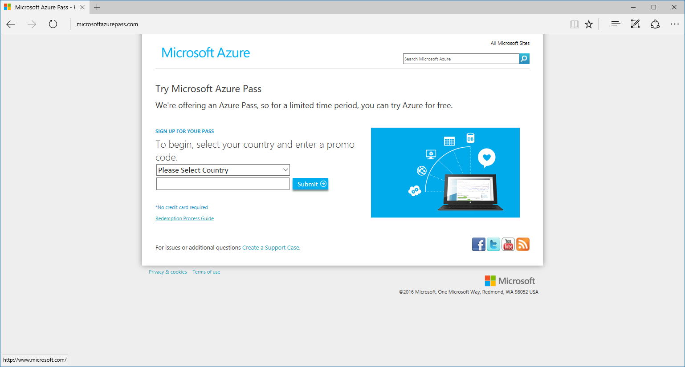
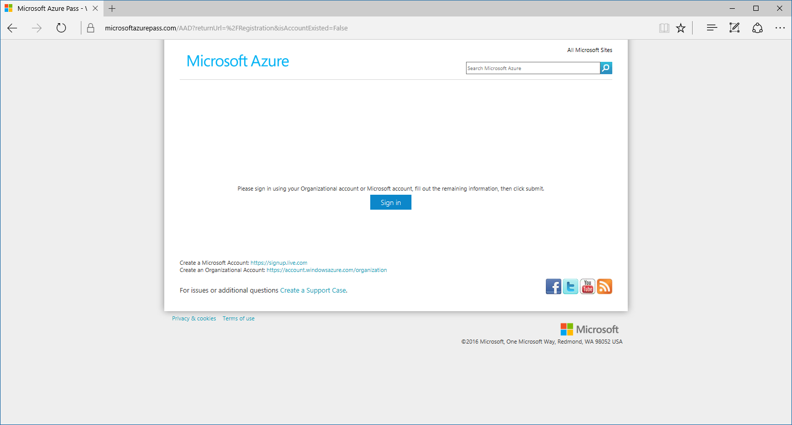
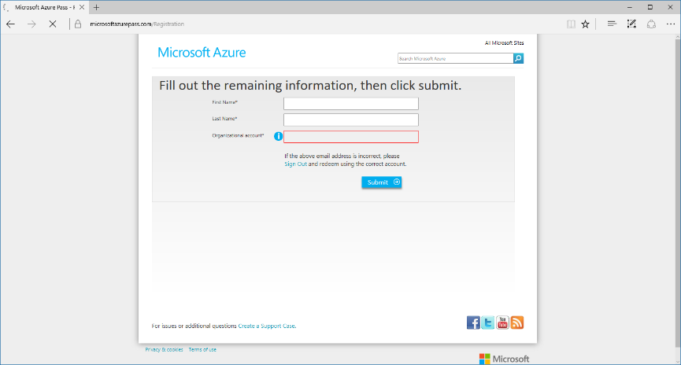
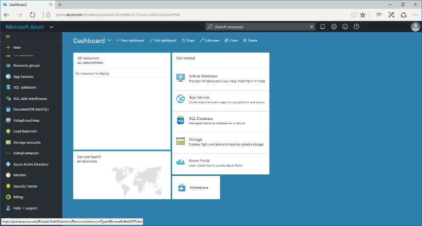

Activación de Microsoft Azure Pass
===============================

Para poder realizar la activación de la suscripción de Microsoft Azure Pass, ha
de seguir los siguientes pasos. Para ello ha de utilizar el código que le habrá
sido enviado y una cuenta Microsoft (Outlook, Hotmail, Live…) que no haya
utilizado anteriormente esta promoción u otras similares (Azure Grants, Azure
Pass…).

Portal de activación 
---------------------

Para poder activar la suscripción, ha de acceder a
<http://microsoftazurepass.com> y seleccionar el país e introducir el código que
le han proporcionado. Posteriormente pulsará en el botón “Submit”.

**Importante**: una vez pulsado el botón, no podrá volver a usar el código, por
lo que ha de realizar todo el proceso en un solo intento.

El siguiente paso es introducir la cuenta con la cual se asociará la suscripción
de Microsoft Azure. Para ello debe utilizar una cuenta Microsoft (Outlook,
Hotmail, Live…).

Una vez iniciada la sesión, le aparecerá una ventana con sus datos para
comprobarlos y la opción de enviar la petición con el botón “Submit”. Púlselo y
espere a recibir un correo en la dirección de correo electrónico utilizada.

Una vez recibido el correo electrónico, ya estará activada su suscripción de
Microsoft Azure, y podrá acceder a ella a través de
[https://portal.azure.com/](https://portal.azure.com/signin/index/?cdnIndex=4&l=en.en-us)
con las credenciales utilizadas en los pasos anteriores.

