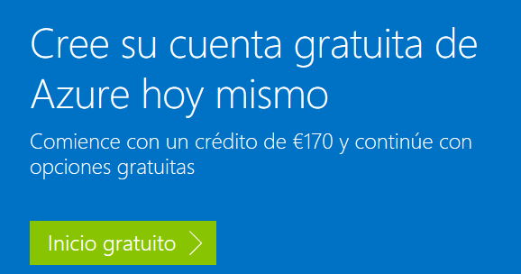
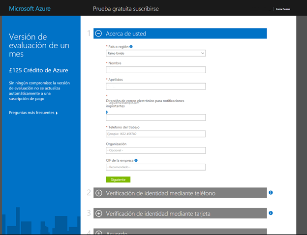
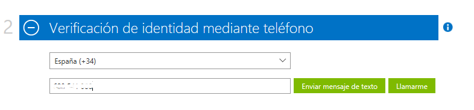
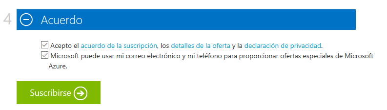
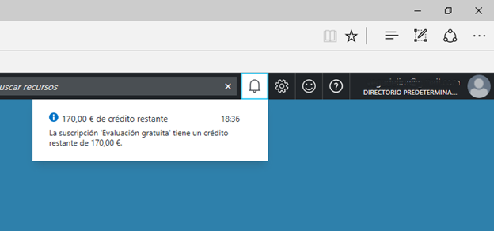

Activación de Microsoft Azure Trial
===========================================

Para poder realizar la activación de la suscripción de Microsoft Azure Trial, ha
de seguir los siguientes pasos.

Entra en: [https://azure.microsoft.com/es-es/free/](https://azure.microsoft.com/es-es/free/) y haz *click* en “**Inicio gratuito \>**”

Deberás iniciar sesión con una cuenta que tenga asociado un Live ID (Microsoft Account). Si no es una cuenta \@hotmail.com o \@outlook.com. O si no está asociada a un
Office 365 puedes hacerle un live ID a cualquier correo en esta dirección:
[https://mid.live.com/](https://mid.live.com/)

Es importante que con esta misma cuenta no hayas creado ya ninguna otra cuenta
trial, ni tenga una suscripción de Azure asociada.

Rellena el formulario:

Introduce tus datos, y verifica tu identidad con tu teléfono y tu tarjeta de
crédito.

**Importante**: la versión de evaluación no se actualiza automáticamente a una
suscripción de pago.

Haz click en el botón “Siguiente” para pasar de sección en sección:

Introducción del número de teléfono para verificación de la identidad:

Y después, introducir los datos de la tarjeta de crédito.

*Esta información se recopila solamente para comprobar su identidad. No se le
cobrará a menos que actualice explícitamente a una oferta de pago.*

Acepta el acuerdo de la suscripción y haz click en el botón de “Suscribirse”.

Espera mientras se crea tu suscripción:

Ya está lista tu suscripción von 170€ y puedes empezar a usarla:

