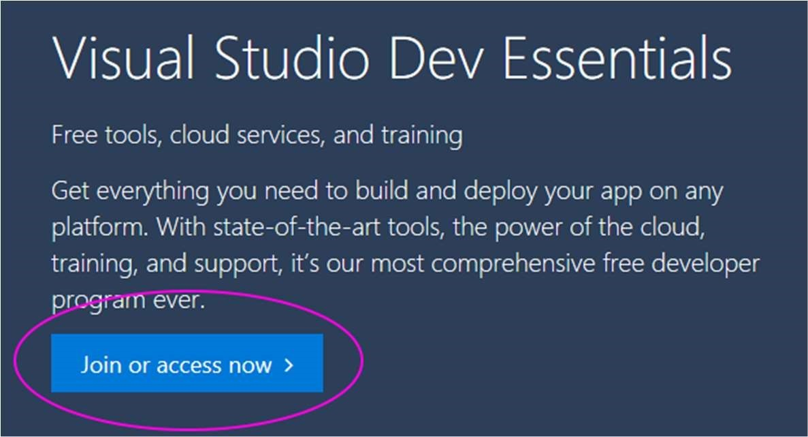
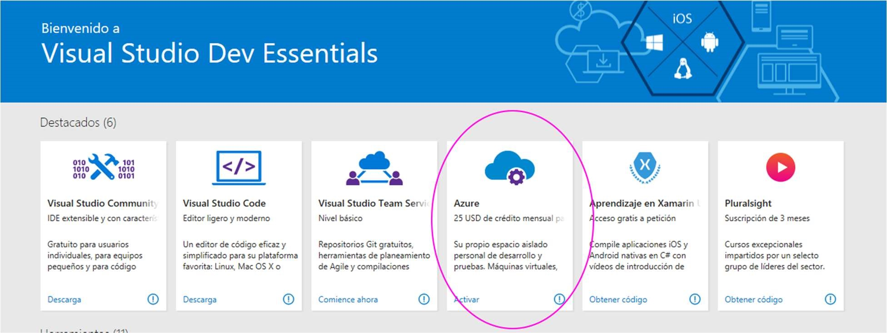

Activación de Microsoft Azure vía Microsoft Imagine
===============================

Para poder realizar la activación de la suscripción de Microsoft Azure con Microsoft Imagine, ha
de seguir los siguientes pasos.

## Crear cuenta en Visual Studio Dev Essentials

Entra en: <https://www.visualstudio.com/dev-essentials/<

Y haz click en “Join or access now \> “

Deberás iniciar sesión con una cuenta que tenga asociado un Live ID (Microsoft Account). Si no es una cuenta \@hotmail.com o \@outlook.com. O si no está asociada a un Office 365 puedes hacerle un live ID a cualquier correo en esta dirección: <https://mid.live.com/>.

## Activar Microsoft Azure a través de  Visual Studio Dev Essentials

Busca el beneficio “Azure”, dentro de la cuenta de Dev Essential y haz click en “Activar”. <https://my.visualstudio.com/benefits>

Rellena la información necesaria (incluyendo la tarjeta de crédito). Esta información servirá sólo para validarte, no se cobrará nada a no ser que tú mismo amplíes la suscripción.

Ahora sólo tienes que esperar a que se active tu suscripción, que tardará más o menos según la carga de trabajo que haya en ese momento.

Una vez que la suscripción esté preparada, te saldrá el siguiente mensaje en la misma pantalla:

Si haces click en “Empezar a administrar mi servicio \>” llegarás al portal de Azure, donde puedes empezar a probar.
