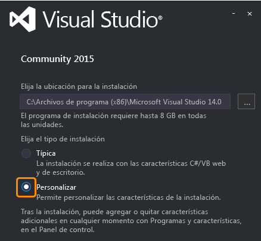
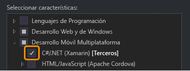

# Preparación para Workshop Xamarin y Azure
Para poder desarrollar correctamente el workshop de aplicaciones multiplataforma con Xamarin y backend en Microsoft Azure con Mobile Apps es necesaria la configuración del entorno de desarrollo y cuenta de Microsoft Azure. Aquí encontrarás los pasos para realizarlo.

## Instalación de Xamarin
Para poder desarrollar tus aplicaciones con Xamarin, recomendamos utilizar Visual Studio en Windows. Para ello, puedes descargar la versión gratuita: ([Visual Studio Community](https://www.visualstudio.com/es/vs/community/)).
Durante el proceso de instalación, deberás seleccionar la opción de Personalizar, y activar la casilla de Desarrollo Móvil Multiplataforma > C#/.NET (Xamarin). ([Más información](https://msdn.microsoft.com/es-es/library/mt613162.aspx)).

De forma opcional, si utilizas MacOS podras utilizar ([Xamarin Studio](https://www.xamarin.com/download)), aunque este workshop no está
dirigido a esta herramienta.

## Activación de Microsoft Azure
Para poder gestionar el backend de la aplicación se hará uso de Microsoft Azure y su servicio Mobile App. Para ello, deberá activar su suscripción de Microsoft Azure utilizando uno de los siguientes metodos:

- Si eres estudiantes: ([Microsoft Imagine](Manuals/Microsoft via Microsoft Imagine.pdf))
- Si tienes un Microsoft Azure Pass: ([Microsoft Azure Pass](Manuals/Microsoft Azure Pass.pdf))
- Para todos los demás: ([Visual Studio Dev Essentials](Manuals/Microsoft Azure via Dev Essentials)) 
- También puedes utilizar una prueba completa de Microsoft Azure: ([Microsoft Azure Trial](Manuals/Microsoft Azure Trial))
