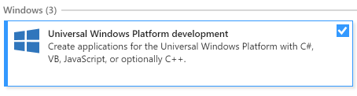
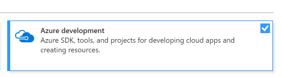
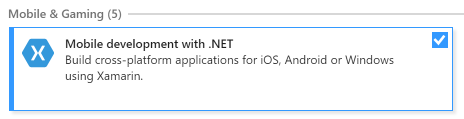

# Preparación para de entorno para usar Xamarin y Microsoft Azure
Para poder desarrollar correctamente aplicaciones multiplataforma con Xamarin y backend en Microsoft Azure con Mobile Apps es necesaria la configuración del entorno de desarrollo y cuenta de Microsoft Azure. Aquí encontrarás los pasos para realizarlo.

## Instalación de Xamarin
Para poder desarrollar tus aplicaciones con Xamarin, recomendamos utilizar **Visual Studio 2017** en Windows 10. Para ello, puedes descargar la versión gratuita: [Visual Studio Community](https://www.visualstudio.com/es/vs/community/).

Durante el proceso de instalación, deberás seleccionar las opciones:
- Universal Windows Platform development
- Azure development
- Mobile development with .NET

De forma opcional, si utilizas MacOS podras utilizar [Visual Studio for Mac](https://www.visualstudio.com/es/vs/visual-studio-mac/).

## Activación de Microsoft Azure
Para poder gestionar el backend de la aplicación se hará uso de Microsoft Azure y su servicio Mobile App. Para ello, deberá activar su suscripción de Microsoft Azure utilizando uno de los siguientes metodos:

- Si eres estudiante: [Microsoft Imagine](Microsoft Azure con Microsoft Imagine.md)
- Si tienes un Microsoft Azure Pass: [Microsoft Azure Pass](Microsoft Azure Pass.md)
- Para todos los demás: [Visual Studio Dev Essentials](Microsoft Azure con Dev Essentials.md) 
- También puedes utilizar una prueba completa de Microsoft Azure: [Microsoft Azure Trial](Microsoft Azure Trial.md)

## Comprueba que todo esta correcto
Para comprobar que todo funciona correctamente para la formación, por favor, realiza las siguientes pruebas:
- Comprueba que puedes compilar el siguiente [proyecto](https://github.com/xamarin/dev-days-labs/tree/master/HandsOnLab/Start).
- Comprueba que puedes acceder a [Microsoft Azure](https://portal.azure.com/) y muestra la suscripción correcta.
